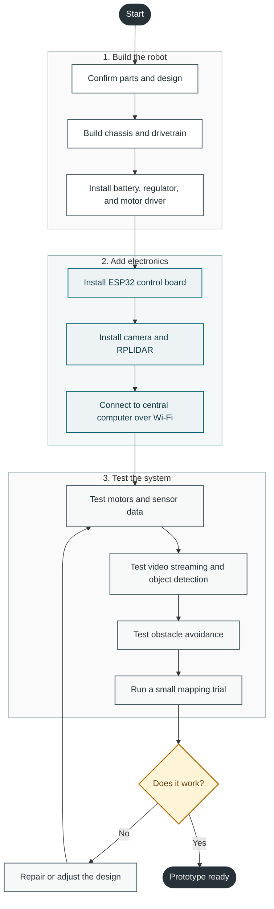
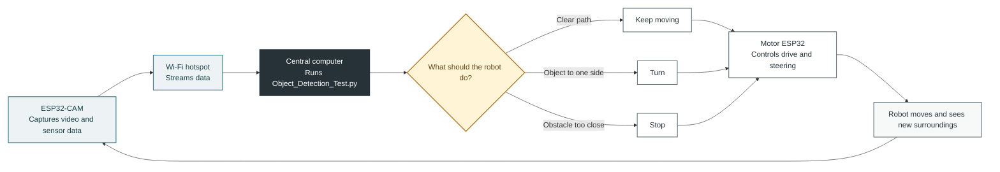

# Dirtlets Build Camp

A visual checklist for building and testing one prototype:

## Build Order

1. Confirm the parts and wiring plan.
2. Build the chassis and drivetrain.
3. Add power regulation and motor control.
4. Install the ESP32, camera, and RPLIDAR.
5. Connect the robot to the central computer.
6. Test movement, streaming, sensing, and obstacle avoidance.
7. Run a small mapping test and improve the design.

## Robot Control Loop

This shows how video and commands travel during operation:

The loop repeats continuously: the camera sends new information, the central computer makes a decision, and the motor ESP32 carries out the command.

