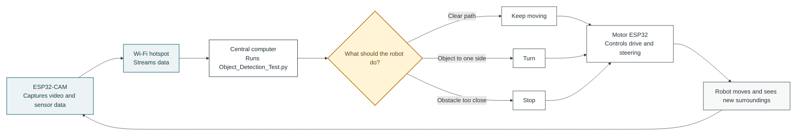

# Dirtlets Build Camp

## What could these robots possibly look like?

| Option 1 | Option 2 | Option 3 |
|:---:|:---:|:---:|
|  |  |  |

## What ways can we go about building these robots?

Possible Direction:

```mermaid
%%{init: {"flowchart": {"nodeSpacing": 70, "rankSpacing": 90, "diagramPadding": 20}, "themeVariables": {"fontSize": "18px"}}}%%
flowchart LR
    A[Tracked rover swarm] --> B[ESP32-CAM, RPLIDAR C1, and MPU-650]
    B --> C[Central computer receives video and sensor data]
    C --> D[Build shared map and analyze terrain]
    D --> E[Calculate each rover's Health Score]
    E --> F{Best rover for local leadership?}
    F -->|Yes| G[Leader relays group data]
    F -->|No| H[Another rover leads]
    G --> I[Central computer identifies a promising area]
    H --> I
    I --> J[Send safe navigation commands]
    J --> K[Swarm travels and spreads out]
    K --> L[Investigate the area and update the map]
    L --> B

    classDef system fill:#ffffff,stroke:#384a52,stroke-width:1.5px,color:#1f2d33;
    classDef sensing fill:#ffffff,stroke:#176b78,stroke-width:1.5px,color:#173f46;
    classDef analysis fill:#ffffff,stroke:#52636b,stroke-width:1.5px,color:#263238;
    classDef decision fill:#ffffff,stroke:#9a6a18,stroke-width:2px,color:#5f4313;
    class A,J,K,L system;
    class B sensing;
    class C,D,E,G,H,I analysis;
    class F decision;
```

## Build Order

1. Confirm compatibility for the RPLIDAR C1, MPU-650, ESP32 boards, motor driver, UBEC, battery, and motors.
2. Print the tread chassis and mount the two JGY 370 motors.
3. Install the 3S LiPo, battery connectors, UBEC 5V/3A regulator, and motor driver.
4. Install the motor control ESP32 and ESP32-CAM.
5. Mount and wire the RPLIDAR C1 and MPU-650.
6. Test power, motors, video streaming, lidar data, and IMU data separately.
7. Connect the video stream to the central computer and test YOLO with OpenCV overlays.
8. Run a first mapping trial and document what needs improvement.

## Robot Control Loop

This shows how video and commands travel during operation:

The loop repeats continuously: the camera sends new information, the central computer makes a decision, and the motor ESP32 carries out the command.

Credit to CHATGPT for test Image generation on possible paint styles and camera positioning
