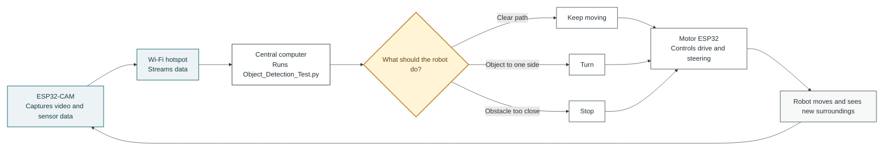

# Dirtlets Build Documentation

## Why the name Dirtlets?
I named Dirtlets to sound like the Pokémon Diglett because, although they are completely different, I found that the multi-agent aspect and their movement through the dirt closely match the main aspects of both the Pokémon and the rover.

## What do Dirtlets do? 
Dirtlets are a prototype built to answer a single central question: How can a fleet of low cost, autonomous rovers work together to map unknown terrain, detect safe and promising landing areas, and gather useful environmental information more efficiently and reliably than a single large and expensive rover? And how might homosygous rover swarm systems far surpass the future of single large rovers?

## What does the working Architecture look like behind the bot?

| Option 1 | Option 2 | Option 3 |
|:---:|:---:|:---:|
|  |  |  |

## Robot Control Loop

This shows how video and commands travel during operation:

The loop repeats continuously: the camera sends new information, the central computer makes a decision, and the ESP-32 motor controller carries out the command.

## How do the robots communicate and perform complex operations on limited hardware?

 

## How does the robot traverse landscapes without getting stuck or hitting something?

# The Answer is Obstical Avoidence. 
With the introduction of the RGB Camera as an addon I have been utilizing YOLO and OpenCV to dected and try to gauge how far objects are and the probilitlity of hitting it using (Blank for now IDK how I will figure it out)

# How can we build these robots?

1. **Prepare the design and parts.** Before printing or wiring, confirm the chassis dimensions, wheel or tread layout, component clearances, mounting holes, cable routes, and estimated center of gravity. The current prototype uses a 3D printer with at least a 200 × 200 mm build area (a Creality Ender 3 Pro was used), two JGY-370 12 V, 10 RPM worm-gear motors, an RPLIDAR A1 or C1, an MPU-650 IMU, one or more ESP32 boards, an ESP32-CAM, a motor driver, a 5 V/3 A UBEC or buck regulator, a suitable 3S LiPo battery, a LiPo-compatible balance charger, battery connectors, wire, heat-shrink tubing, cable ties, solder, and basic hand tools. Choose a motor driver that is rated for the motors' continuous and stall current; do not select it based only on the motor's nominal voltage.

2. **Plan the electrical system.** Draw a wiring diagram before connecting the battery. Route the battery through an appropriate switch or fused power-distribution point, then provide separate regulated power for the logic and sensors. Verify the UBEC output with a multimeter before connecting an ESP32 or sensor. Check the polarity of every connector, use strain relief on battery and motor wires, keep motor wiring separated from sensor wiring where practical, and connect all required grounds. Do not power motors directly from an ESP32. Ensure that the regulator, connectors, wire gauge, and motor driver can handle the expected current and heat.

3. **Print and inspect the chassis.** Print the base, wheel or tread components, motor mounts, sensor brackets, electronics enclosure, and protective covers using material and wall thickness appropriate for the expected impacts. Remove support material, check that mounting holes and shafts fit, and test-fit every component before final assembly. Leave access for the battery, USB programming cables, charging connector, ventilation, and an emergency power disconnect. Avoid enclosing heat-producing electronics without a way for heat to escape.

4. **Install the drivetrain.** Secure both JGY-370 motors with rigid mounts and verify that their shafts are parallel. Attach the wheels, sprockets, or treads so they rotate freely without rubbing the chassis. Confirm that the left and right sides are mechanically aligned, then turn each side by hand to check for binding. Use thread-locking hardware where appropriate, but do not allow adhesive or loose fasteners to enter a gearbox. Record which motor leads correspond to forward motion so the software can be configured consistently.

5. **Assemble and secure the power system.** Install the battery in a protected, padded compartment so it cannot move during operation. Connect the battery, fuse or switch, power distribution, UBEC, motor driver, and ESP32 only according to the verified wiring diagram. Insulate solder joints with heat-shrink tubing, secure wires away from moving parts, and label connectors. Inspect the assembly for exposed conductors or short circuits before inserting the battery. LiPo batteries must be charged, stored, transported, and monitored using appropriate LiPo procedures and a compatible balance charger; never use a damaged, swollen, hot, or leaking pack, and never leave charging unattended.

6. **Mount the electronics and sensors.** Install the motor-control ESP32 and ESP32-CAM on standoffs or another non-conductive mounting surface. Mount the RPLIDAR level and clear of the chassis, wheels, and camera field of view. Mount the MPU-650 securely with a known orientation and minimal vibration, and record that orientation in the software configuration. Keep the camera lens and lidar window unobstructed. If the enclosure must be cut for a sensor, smooth the opening and seal it with a suitable gasket or cover while preserving the sensor's required field of view and ventilation.

7. **Complete the wiring and firmware setup.** Connect the motor driver control pins, camera, lidar, IMU, and regulated power according to the pin map. Avoid using pins required for boot mode or other onboard functions unless the firmware and board documentation support it. Flash the motor-control firmware and camera firmware separately, configure Wi-Fi credentials and device names, and add a safe startup state in which the motors remain disabled until a valid command is received. Include a watchdog, command timeout, and immediate stop command so communication loss does not leave the motors running.

8. **Perform staged tests without the drivetrain loaded.** First test continuity and regulated voltages with the battery disconnected, then power the logic system with the motors disabled. Confirm serial logs, Wi-Fi connection, camera streaming, lidar scans, and IMU readings independently. Lift the rover so the wheels cannot contact anything and test each motor at low power. Verify forward, reverse, left, and right commands, emergency stop behavior, current draw, and motor-driver temperature. Stop immediately if wiring, connectors, motors, or the battery become unexpectedly hot.

9. **Calibrate and integrate the sensors.** Calibrate the MPU-650 accelerometer and gyroscope on a stationary, level surface and record the offsets. Check that lidar distances remain stable while the rover is stationary and that the scan direction matches the software map. Adjust the camera exposure and focus, confirm that the video stream has acceptable latency, and test YOLO/OpenCV overlays on representative terrain. Validate that timestamps, coordinate frames, and units are consistent before combining camera, lidar, and IMU data.

10. **Run controlled driving tests.** Begin on a clear, flat surface with a physical stop or operator-controlled power disconnect nearby. Test straight-line motion, turning in both directions, stopping distance, obstacle detection, Wi-Fi range, and operation time. Increase speed and autonomy gradually. Check fasteners, tread tension, cable routing, battery voltage, and component temperatures after each run. Do not operate near people, animals, stairs, traffic, or water until the system has passed these tests.

11. **Run the first mapping trial and document results.** Start with a small, known area and log camera frames, lidar data, IMU data, commands, battery voltage, and communication status. Compare the generated map with the real layout, note missed obstacles and false detections, and record failures such as drift, packet loss, overheating, or motor stalls. Make one change at a time, retest, and keep the wiring diagram, pin map, firmware version, calibration values, and build notes with the prototype.

Credit to OpenAI (2026) For test Image generation on possible paint styles and previews
Credit to Anthropic (2026) For Re-Coloring Flowchart #1 into Martian Colors