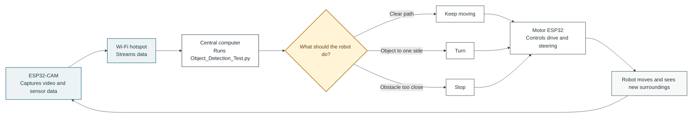

# Dirtlets Build Documentation

## What does the working Architecture look like behind the bot?

| Option 1 | Option 2 | Option 3 |
|:---:|:---:|:---:|
|  |  |  |

## How can we build these robots?

1. Confirm you have all required materials:  
3d Printer at least 200x200 I used the Creality Ender3-Pro. 
RPLidar A1/C1. 
MPU 650. 
ESP 32E. 
RC bEC UBEC 5V 3A Step. 
Lipo Battery 2200AH *Could go Duel. 
Lipo Specific Charger *Make sure it is for LIPO battery explosions do happen. Drive Control Boards or ESP 32Es. 
Connectors for Battery to Power. 
ESP 32 RGB Camera
Wire. 
Zip Ties. 
Solder Wire + Mat + Solder Stick
JGY 370 12v 10rpm DC worm moters 2x

2. Print the tread or wheeled chassis and mount the two JGY 370 motors.
3. Install the 3S LiPo, battery connectors, UBEC 5V/3A regulator, and motor driver.
4. Install the motor control ESP32 and ESP32-CAM.
5. Mount and wire the RPLIDAR C1 and MPU-650.
6. Test power, motors, video streaming, lidar data, and IMU data separately.
7. Connect the video stream to the central computer and test YOLO with OpenCV overlays.
8. Run a first mapping trial and document what needs improvement.

## Robot Control Loop

This shows how video and commands travel during operation:

The loop repeats continuously: the camera sends new information, the central computer makes a decision, and the motor ESP32 carries out the command.

## How do the robots communicate and perform complex operations on limited hardware?

 

## How does the robot traverse landscapes without getting stuck or hitting something?

# The Answer is Obstical Avoidence. 
With the introduction of the RGB Camera as an addon I have been utilizing YOLO and OpenCV to dected and try to gauge how far objects are and the probilitlity of hitting it using (Blank for now IDK how I will figure it out)

Credit to OpenAI (2026) For test Image generation on possible paint styles and previews
Credit to Anthropic (2026) For Re-Coloring Flowchart #1 into Martian Colors