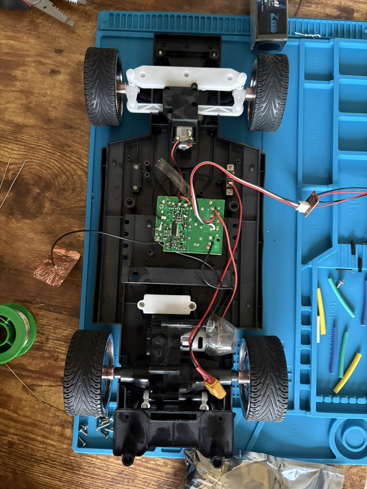

# Dirtlets
Dirtlets are little robots that are being designed to be a proof of concept SWARM to navigate, map, and score terrain for lunar and planetary bases for human expansion.

## What are Dirtlets?
Dirtlets are little robots designed to autonomously navigate, map, and record environmental conditions to collectively create a map of an area or multiple areas. They also use a leader election system based on a Health Score (HS) calculated from battery life, mobility, current location, and other metrics to determine which leader will transmit the gathered data back to the central computer.

## Documentation

- [Rational](Rational.md): project rationale, design decisions, and swarm architecture.

- [Problems and Parts List](problems.txt): design problems, parts, costs, and current hardware options things I encountered that made me mad.

- [Build Documentation](Documentation-For-Building-and-other-problems.md): assembly, wiring, safety, testing, and design revisions. But to be honest, it lacks much of the building as of now.

- [ESP32 Setup](ESP32_Setup.md): ESP32 development and hardware setup notes. Helps with setting up data transmission and just tinkering with your stuff.

- [Log Book](Log-Book.txt): dated project progress and decisions. More professional logging of information and direction than my problems file. 

- [Photos](Photos): All photos used in various documentation surrounding the project

# Progress Photos

### Tuesday September 22
- Stripped out all old RC internals
- Replaced with another cars motor controller. 
- Replaced old motor with a new one that actually works

#

